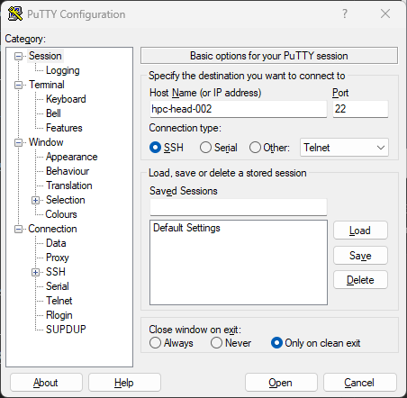

# Logging in

Once access is granted, you can log in using an SSH client such as:

- PuTTy (available on Windows) - click [here](#using-putty) for instructions
- Terminal (available on Linux, macOS, Windows) - click [here](#using-terminal) for instructions

Use your NHM username and password, which are the same credentials you use to log into your NHM computer, if you have one.

> If you are on an NHM computer (either at the museum or remotely via VPN), log in directly to the head node **hpc-head-002**. If you are using a non-NHM computer, you need to connect through the bastion, which is known as **orca**. For detailed instructions on connecting through the orca, click here: INSERT LINK TO ORCA GUIDE!

## Using PuTTy

To log in using PuTTy, enter the hostname `hpc-head-002` and select **Open**. 



Enter your username and password at the prompt to log in, and you will be presented with the welcome message:
```
login as: robtest1234
Pre-authentication banner message from server:
| -----------------------------------------------------------
| ---  This is the Natural History Museum in London, UK.  ---
| ---  If you are not an authorised user GO NO FURTHER !  ---
| ---  If you have problems connecting, contact :         ---
| ---          ts-servicedesk@nhm.ac.uk                   ---
| -----------------------------------------------------------
End of banner message from server
robtest1234@hpc-head-002's password:
Last login: Thu Feb  6 21:36:12 2025 from 157.140.3.51

--------------------------------------
---   Welcome to the HPC cluster   ---
--------------------------------------

User guide:
https://naturalhistorymuseum.sharepoint.com/:w:/r/sites/HPCCAB/Sha...


Visit the HPC Users Community on Microsoft Teams:
https://teams.microsoft.com/l/channel/19%3a8aa968ad33924f1e9ac3b4a...

robtest1234@hpc-head-002:~$
```

## Using Terminal

To log in using a terminal, type `ssh <username>@hpc-head-002`. For example:
```
PS C:\Users\robef3> ssh robtest1234@hpc-head-002
-----------------------------------------------------------
---  This is the Natural History Museum in London, UK.  ---
---  If you are not an authorised user GO NO FURTHER !  ---
---  If you have problems connecting, contact :         ---
---          ts-servicedesk@nhm.ac.uk                   ---
-----------------------------------------------------------
robtest1234@hpc-head-002's password:
Welcome to Ubuntu 20.04.6 LTS (GNU/Linux 5.4.0-187-generic x86_64)

 * Documentation:  https://help.ubuntu.com
 * Management:     https://landscape.canonical.com
 * Support:        https://ubuntu.com/advantage

# ...

robtest1234@hpc-head-002:~$
```
